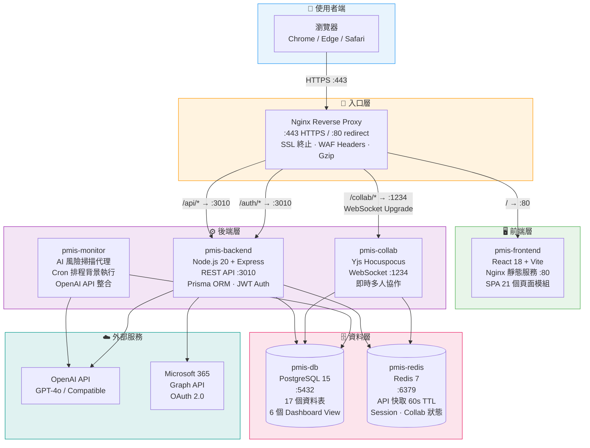
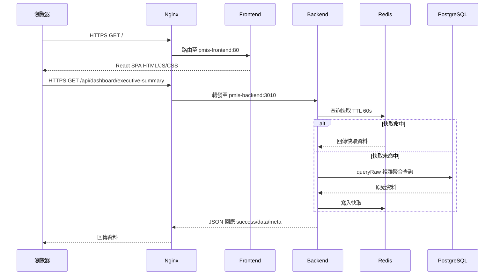
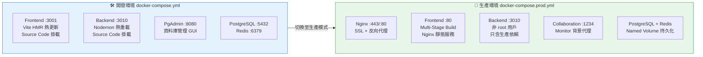
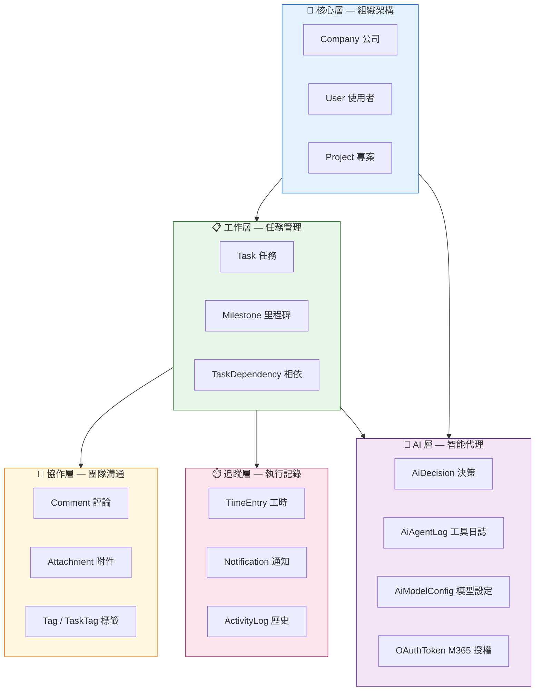
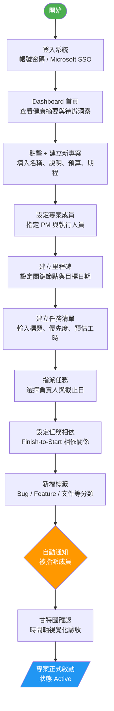
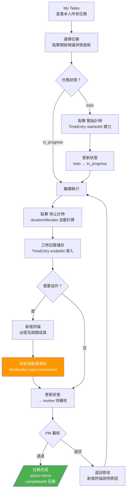
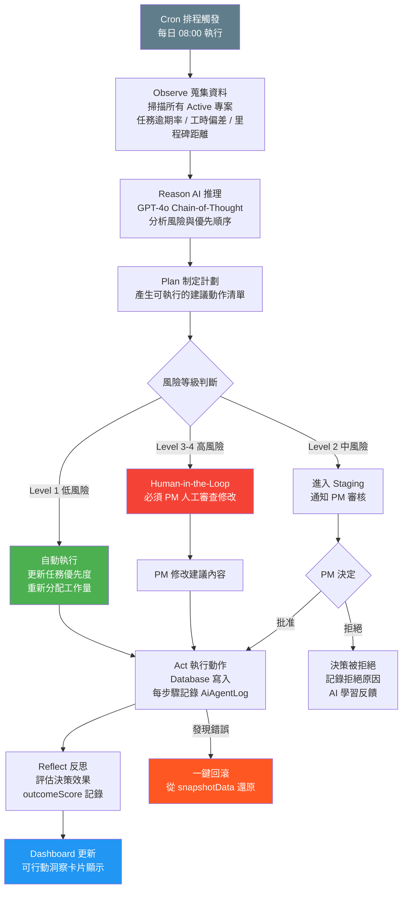
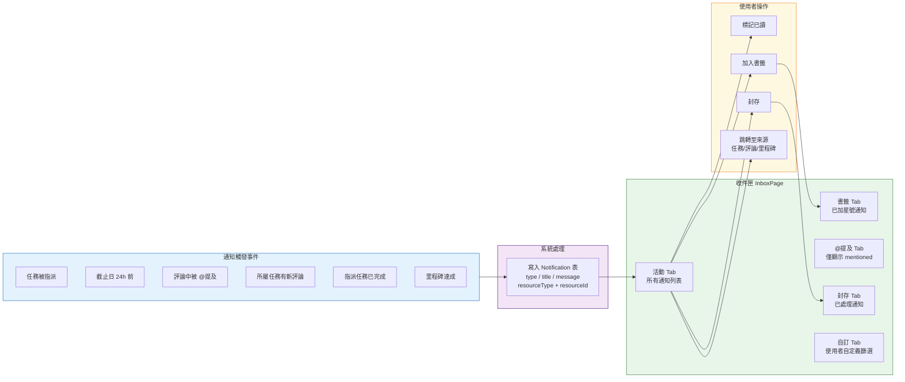
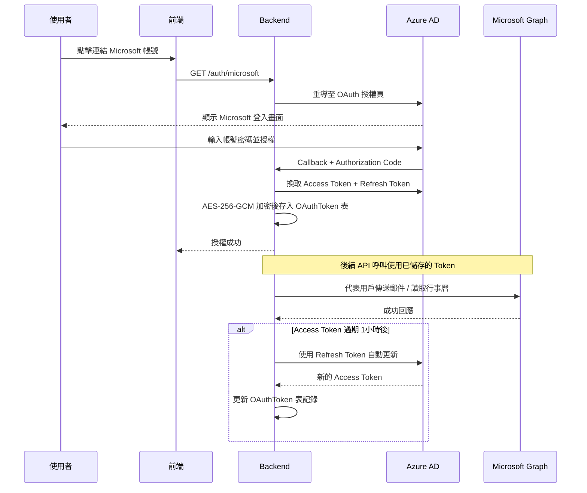

# xCloudPMIS — 企業級 AI 專案管理系統

> 整合 AI 自主代理、即時協作、Microsoft 365 的企業級專案管理平台
> 採用 Docker 全容器化架構，支援地端部署與 Azure 雲端部署

[](https://nodejs.org)
[](https://react.dev)
[](https://www.postgresql.org)
[](https://redis.io)
[](https://www.docker.com)
[](https://www.prisma.io)
[](https://openai.com)

---

## 目錄

- [系統介紹](#系統介紹)
- [系統架構圖](#系統架構圖)
- [資料庫關聯圖](#資料庫關聯圖)
- [使用者操作流程圖](#使用者操作流程圖)
- [技術堆疊](#技術堆疊)
- [快速啟動（開發環境）](#快速啟動開發環境)
- [生產部署](#生產部署)
- [部署文件導覽](#部署文件導覽)
- [服務清單](#服務清單)
- [API 文件](#api-文件)
- [功能模組](#功能模組)
- [專案目錄結構](#專案目錄結構)
- [開發歷程](#開發歷程)

---

## 系統介紹

**xCloudPMIS** 是一套整合 AI 自主決策能力的企業級專案管理資訊系統，以政府機關與中大型企業為核心使用場景，提供從任務規劃到執行監控的完整生命週期管理。

### 核心功能模組

| 模組 | 頁面 | 說明 |
|------|------|------|
| **執行儀表板** | Dashboard | 紅黃綠燈健康狀態、人力熱力圖、可行動洞察；統計卡片可點擊快速導航 |
| **專案管理** | Projects | 建立、追蹤、管理多個工程專案；支援列表 / 看板 / 甘特多視圖 |
| **任務看板** | Tasks (Kanban) | 拖拉式看板，支援 To-Do / In-Progress / Review / Done |
| **我的任務** | My Tasks | 個人任務彙整，依截止日期自動分組；支援刪除、編輯、截止日期與優先度修改 |
| **甘特圖** | Gantt | 時間軸視覺化，任務相依性連線 |
| **時間記錄** | Time Tracking | 即時計時器 + 手動工時登錄 |
| **工作負載** | Workload | 未來 14 天人力分配熱力圖 |
| **報表** | Reports | 多維度統計分析；列表列可點擊開啟詳情、支援 CSV 匯出 |
| **專案集** | Portfolios | 多專案健康監控；狀態 Dropdown 正常切換、點擊專案名稱導航 |
| **團隊管理** | Team | 成員管理、角色設定 |
| **收件匣** | Inbox | 通知中心（任務指派、@提及、截止日提醒） |
| **AI 決策中心** | AI Decision Center | ReAct 自主代理決策記錄與審核 |
| **AI 模型設定** | AI Settings | 支援 OpenAI / Ollama / LM Studio / Azure 等 |
| **MCP 控制台** | MCP Console | Claude Desktop 直接操作系統工具 |
| **檔案管理** | Files API | 附件上傳下載；繁體中文檔名正確儲存（UTF-8 修復） |

---

## 系統架構圖

### 全系統容器架構



### 請求路由流程



### 開發 vs 生產環境對照



---

## 資料庫關聯圖

### 完整 ER 關聯圖（17 個資料表）

```mermaid
erDiagram
    Company {
        int     id          PK
        string  name
        string  slug        UK
        boolean isActive
    }
    User {
        int     id          PK
        int     companyId   FK
        string  name
        string  email       UK
        enum    role        "admin|pm|member"
        boolean isActive
    }
    Project {
        int     id          PK
        int     companyId   FK
        int     ownerId     FK
        string  name
        enum    status      "planning|active|on_hold|completed|cancelled"
        decimal budget
        date    startDate
        date    endDate
    }
    Task {
        int     id             PK
        int     projectId      FK
        int     assigneeId     FK
        int     createdById    FK
        string  title
        enum    status         "todo|in_progress|review|done"
        enum    priority       "low|medium|high|urgent"
        decimal estimatedHours
        decimal actualHours
        date    dueDate
    }
    Milestone {
        int     id          PK
        int     projectId   FK
        string  name
        date    dueDate
        boolean isAchieved
        enum    color       "red|yellow|green"
    }
    TaskDependency {
        int     id              PK
        int     taskId          FK
        int     dependsOnTaskId FK
        enum    type            "finish_to_start|start_to_start|finish_to_finish"
    }
    TimeEntry {
        int      id              PK
        int      taskId          FK
        int      userId          FK
        datetime startedAt
        datetime endedAt
        int      durationMinutes
        date     date
    }
    Attachment {
        int    id           PK
        int    taskId       FK
        int    uploadedById FK
        string originalName
        string mimeType
        int    fileSizeBytes
    }
    Comment {
        int     id       PK
        int     taskId   FK
        int     userId   FK
        int     parentId FK
        string  content
        json    mentions
        boolean isEdited
    }
    Tag {
        int    id        PK
        int    companyId FK
        string name
        string color
    }
    TaskTag {
        int taskId PK-FK
        int tagId  PK-FK
    }
    Notification {
        int     id          PK
        int     recipientId FK
        enum    type        "task_assigned|deadline_approaching|mentioned|comment_added|task_completed|milestone_achieved"
        string  title
        boolean isRead
    }
    ActivityLog {
        int    id      PK
        int    taskId  FK
        int    userId  FK
        string action
        json   oldValue
        json   newValue
    }
    OAuthToken {
        int      id           PK
        int      userId       UK-FK
        string   provider     "microsoft"
        string   accessToken
        string   refreshToken
        datetime expiresAt
        boolean  isActive
    }
    AiDecision {
        int    id           PK
        int    projectId    FK
        int    taskId       FK
        string agentType    "scheduler|risk|communication|quality"
        json   observations
        string reasoning
        int    riskLevel    "1-4"
        enum   status       "pending|staging|approved|executing|completed|rejected|rolled_back|failed"
    }
    AiAgentLog {
        int     id         PK
        int     decisionId FK
        string  toolName
        json    toolInput
        json    toolOutput
        boolean success
        int     durationMs
    }
    AiModelConfig {
        int     id        PK
        int     companyId FK
        string  provider  "openai|azure|ollama|lm_studio|groq|custom"
        string  baseUrl
        string  modelHeavy
        string  modelLight
        boolean isActive
    }

    Company        ||--o{ User           : "擁有"
    Company        ||--o{ Project        : "擁有"
    Company        ||--o{ Tag            : "擁有"
    Company        ||--o{ AiModelConfig  : "設定"
    User           ||--o{ Task           : "負責"
    User           ||--o{ TimeEntry      : "記錄"
    User           ||--o{ Comment        : "發表"
    User           ||--o{ Notification   : "接收"
    User           ||--o{ ActivityLog    : "執行"
    User           ||--o{ Attachment     : "上傳"
    User           |o--|| OAuthToken     : "授權"
    Project        ||--o{ Task           : "包含"
    Project        ||--o{ Milestone      : "設定"
    Project        ||--o{ AiDecision     : "監控"
    Task           ||--o{ TaskDependency : "依賴"
    Task           ||--o{ TimeEntry      : "計時"
    Task           ||--o{ Attachment     : "附件"
    Task           ||--o{ Comment        : "評論"
    Task           ||--o{ ActivityLog    : "歷史"
    Task           ||--o{ TaskTag        : "標記"
    Task           ||--o{ AiDecision     : "分析"
    Tag            ||--o{ TaskTag        : "使用"
    Comment        ||--o{ Comment        : "回覆"
    AiDecision     ||--o{ AiAgentLog     : "日誌"
```

### 資料表模組分層架構



---

## 使用者操作流程圖

### 流程一：專案建立與啟動



### 流程二：任務執行與時間記錄



### 流程三：AI 自主代理決策流程



### 流程四：通知與收件匣管理



### 流程五：Microsoft 365 OAuth 整合



---

## 技術堆疊

| 層級 | 技術 | 版本 | 說明 |
|------|------|------|------|
| **前端框架** | React | 18 | UI 元件框架，Hooks 架構 |
| **前端構建** | Vite | 5 | 開發 HMR + 生產多階段 Build |
| **前端樣式** | Inline Styles | — | 無 Tailwind，全 JS 行內樣式 |
| **圖表** | Recharts | 2 | PieChart / Heatmap 等視覺化 |
| **即時協作** | Tiptap + Yjs | — | 多人同步編輯 + CRDT |
| **後端框架** | Express | 4 | RESTful API + Middleware |
| **執行環境** | Node.js | 20 | Alpine 映像，非 root 運行 |
| **ORM** | Prisma | 5 | Schema-first + `$queryRaw` |
| **主資料庫** | PostgreSQL | 15 | 17 張表 + 6 個 Dashboard VIEW |
| **快取** | Redis | 7 | API 快取 60s TTL + AOF 持久化 |
| **AI** | OpenAI Compatible | — | GPT-4o / Ollama / LM Studio |
| **身份驗證** | JWT + MSAL | — | 本地 JWT + Microsoft OAuth 2.0 |
| **容器** | Docker | 24+ | 多階段 Build，Named Volume |
| **容器編排** | Docker Compose | v2 | 開發 + 生產雙模式 |
| **反向代理** | Nginx | 1.25 | SSL 終止 + 路由分發 |

---

## 快速啟動（開發環境）

### 前置需求

- [Docker Desktop](https://www.docker.com/products/docker-desktop/) ≥ 24.0
- Git

### 步驟

```bash
# 1. Clone 專案
git clone https://github.com/your-org/xCloudPMIS.git
cd xCloudPMIS

# 2. 複製環境變數（開發環境使用預設值即可）
cp .env.example .env

# 3. 啟動所有服務（首次約需 3–5 分鐘建置映像）
docker compose up -d

# 4. 確認服務狀態（等待全部 healthy）
docker compose ps

# 5. 初始化資料庫 Schema
docker exec pmis-backend npx prisma migrate deploy

# 6. 建立範例資料
docker exec pmis-backend npx prisma db seed

# 7. 開啟瀏覽器
open http://localhost:3001
```

### 常用開發指令

```bash
# 查看即時日誌
docker compose logs -f pmis-backend

# 重新啟動後端
docker compose restart pmis-backend

# 進入資料庫
docker exec -it pmis-db psql -U pmis_user pmis_db

# 停止（保留資料）
docker compose down

# 完全重設（含刪除所有資料）⚠️
docker compose down -v
```

---

## 生產部署

### 地端 Docker 一鍵部署

```bash
# 1. 複製並設定環境變數
cp .env.production.example .env
nano .env   # 填入真實密碼

# 2. 執行部署腳本（自動安裝 Docker、SSL、Migration）
sudo bash deploy/onprem/setup.sh
```

→ 詳見 **[地端 Docker 部署手冊](docs/部署手冊/地端Docker部署手冊.md)**

### Azure 雲端部署

```bash
# 設定環境變數
export SUBSCRIPTION_ID="your-subscription-id"
export RESOURCE_GROUP="pmis-prod-rg"
export DB_ADMIN_PASSWORD="YourStrongPassword123!"

# 執行 Azure 資源一鍵建立（約 20–30 分鐘）
bash deploy/azure/azure-setup.sh
```

→ 詳見 **[Azure 部署手冊](docs/部署手冊/Azure部署手冊.md)**

---

## 服務清單

### 開發環境

| 服務 | 網址 | 帳號 | 密碼 |
|------|------|------|------|
| 前端 Dashboard | http://localhost:3001 | — | — |
| 後端 API | http://localhost:3010 | — | — |
| pgAdmin | http://localhost:8080 | admin@pmis.com | admin123 |
| PostgreSQL | localhost:5432 | pmis_user | pmis_password |
| Redis | localhost:6379 | — | redis123 |
| Yjs 協作 | ws://localhost:1234 | — | — |

### 健康檢查端點

```bash
curl http://localhost:3010/health
# → {"status":"ok","service":"pmis-backend","uptime":...}

curl http://localhost:3010/api/status
# → {"backend":{"status":"ok"},"database":{"status":"ok"},"cache":{"status":"ok"}}
```

---

## API 文件

### 統一回應格式

```json
{
  "success": true,
  "data": {},
  "meta": { "total": 10, "page": 1 },
  "timestamp": "2026-03-15T00:00:00.000Z"
}
```

### 主要 API 端點

| 分類 | 方法 | 路徑 | 說明 |
|------|------|------|------|
| **健康** | GET | `/health` | 服務存活檢查 |
| **健康** | GET | `/api/status` | DB + Redis 連線狀態 |
| **儀表板** | GET | `/api/dashboard/executive-summary` | 全公司摘要（紅黃綠燈數量） |
| **儀表板** | GET | `/api/dashboard/projects-health` | 各專案健康狀態列表 |
| **儀表板** | GET | `/api/dashboard/workload` | 14 天人力負載熱力圖 |
| **儀表板** | GET | `/api/dashboard/actionable-insights` | 可行動洞察卡片 |
| **專案** | GET | `/api/projects` | 取得所有專案（含 Redis 快取） |
| **專案** | POST | `/api/projects` | 建立新專案 |
| **任務** | GET | `/api/tasks` | 個人任務列表（純陣列） |
| **使用者** | GET | `/api/users` | 公司成員列表 |
| **甘特** | GET | `/api/gantt/:projectId` | 甘特圖資料（任務 + 相依） |
| **時間** | GET | `/api/time-tracking` | 工時記錄列表 |
| **報表** | GET | `/api/reports/summary` | 專案統計報表 |
| **設定** | GET | `/api/settings/ai-model` | AI 模型設定 |
| **AI** | GET | `/api/ai-decisions` | AI 決策記錄列表 |
| **認證** | GET | `/auth/microsoft` | Microsoft OAuth 2.0 授權 |
| **檔案** | POST | `/api/files/upload` | 上傳附件（繁體中文檔名支援） |
| **檔案** | GET | `/api/files/:id` | 下載附件 |
| **檔案** | GET | `/api/files` | 取得檔案列表 |

---

## 功能模組

```
前端頁面模組（22 個元件目錄）：
├── dashboard/          執行儀表板（摘要卡 + 圓餅圖 + 熱力圖 + 洞察；統計卡片可點擊導航）
├── projects/           專案列表與詳情
├── tasks/              任務看板（Kanban 四欄拖拉）
├── mytasks/            個人任務（依截止日自動分組；側面板支援刪除、截止日、優先度編輯）
├── gantt/              甘特圖（時間軸 + 相依連線）
├── team/               團隊成員管理
├── timetracking/       工時計時器 + 手動登錄
├── workload/           工作負載熱力圖（14 天）
├── reports/            統計報表（列表可點擊、CSV 匯出）
├── inbox/              收件匣（活動/書籤/封存/@提及 + 自訂 Tab）
├── goals/              目標管理 OKR
├── portfolios/         專案集監控（狀態 Dropdown 修復；點擊專案名稱可導航）
├── workflow/           工作流程圖
├── customfields/       自訂欄位管理
├── forms/              表單設計器
├── rules/              自動化規則設定
├── settings/           系統設定
├── ai/                 AI 決策中心 + AI 模型設定
├── mcp/                MCP 控制台（Claude Desktop 整合）
├── discovery/          內容探索頁
├── auth/               登入頁面（帳密 / Microsoft SSO）
└── RealtimeEditor      Yjs 即時多人協作編輯器
```

---

## 專案目錄結構

```
xCloudPMIS/
├── docker-compose.yml              # 開發環境（7 服務，含 HMR）
├── docker-compose.prod.yml         # 生產環境（含 Nginx 反向代理）
├── docker-compose.mcp.yml          # MCP Server 擴充設定
├── .env.example                    # 開發環境變數範本
├── .env.production.example         # 生產環境變數範本
│
├── docker/                         # 生產 Docker 設定
│   ├── frontend/
│   │   ├── Dockerfile.prod         # 多階段構建：Vite build → Nginx
│   │   └── nginx.conf              # SPA 路由 + 靜態快取設定
│   ├── backend/
│   │   └── Dockerfile.prod         # 多階段構建：非 root 用戶
│   └── nginx/
│       └── nginx.conf              # 反向代理 + SSL + WebSocket
│
├── deploy/                         # 部署腳本
│   ├── onprem/
│   │   ├── setup.sh                # 地端一鍵部署腳本
│   │   └── backup.sh               # 自動備份腳本
│   └── azure/
│       ├── azure-setup.sh          # Azure 資源一鍵建立
│       └── acr-build-push.sh       # ACR 映像建置推送
│
├── backend/                        # Node.js Express 後端
│   ├── Dockerfile                  # 開發用 Dockerfile
│   ├── package.json
│   ├── prisma/
│   │   ├── schema.prisma           # 17 張資料表定義
│   │   └── seed.js                 # 範例資料
│   ├── src/
│   │   ├── index.js                # Express 應用進入點（16 個路由）
│   │   ├── middleware/
│   │   │   └── oauthAuth.js        # Microsoft OAuth 中介層
│   │   ├── routes/                 # 14 個 API 路由模組（含 files.js 附件管理）
│   │   └── services/               # 商業邏輯（AI / Email / Cache）
│   ├── mcp/                        # MCP Server（Claude 工具整合）
│   ├── services/                   # 協作伺服器 + 自主代理
│   └── jobs/                       # 背景工作（AI 風險掃描）
│
├── frontend/                       # React + Vite 前端
│   ├── Dockerfile                  # 開發用 Dockerfile
│   ├── vite.config.js
│   └── src/
│       ├── App.jsx
│       ├── main.jsx
│       ├── hooks/                  # useAiDecisions, useRealtimeTask
│       └── components/             # 21 個頁面模組
│
├── database/                       # 資料庫腳本
│   ├── init/01_create_tables.sql   # Docker 初始化 SQL
│   ├── dashboard_views.sql         # 6 個 Dashboard PostgreSQL VIEW
│   └── schema_reference.sql        # Schema 參考文件
│
└── docs/                           # 技術文件
    ├── 部署手冊/
    │   ├── 地端Docker部署手冊.md   # 完整地端部署指南（15 章）
    │   └── Azure部署手冊.md        # 完整 Azure 雲端部署指南（16 章）
    ├── EXCHANGE_SETUP.md           # Microsoft 365 郵件設定
    └── MCP_USAGE.md                # Claude Desktop MCP 整合指南
```

---

## 開發歷程

### ✅ Phase 1 — 基礎架構
- Docker Compose 五服務環境（PostgreSQL、pgAdmin、Redis、Express、React）
- Prisma ORM 初始 Schema（Company、User、Project、Task）

### ✅ Phase 2 — 核心 CRUD
- 專案與任務的完整 CRUD API
- Redis 快取層（60 秒 TTL，AOF 持久化）
- 前端列表與表單元件

### ✅ Phase 3 — 進階協作功能
- 8 張新資料表（Milestone、TimeEntry、Attachment、Comment、Tag、TaskDependency、Notification、ActivityLog）
- 任務相依性（Finish-to-Start、Start-to-Start、Finish-to-Finish）
- @mention 通知系統（PostgreSQL JSONB）
- 即時計時器（防重複計時 Partial Unique Index）

### ✅ Phase 4 — 執行儀表板 + AI 整合
- 6 個 PostgreSQL Dashboard VIEW（紅黃綠健康燈號三重判斷）
- AI 自主代理架構（ReAct 推理鏈 + Human-in-the-Loop）
- Microsoft 365 OAuth 整合（AES-256-GCM Token 加密）
- AI 模型設定管理（支援 OpenAI / Azure / Ollama / 地端模型）
- MCP Server（Claude Desktop 直接操作系統）

### ✅ Phase 5 — 前端完整化 + Bug 修復
- 21 個前端頁面模組全部完成
- 收件匣完整重寫（自訂 Tab + 書籤 + 封存 + @提及）
- MyTasksPage 物件型別相容修復（assignee / project 巢狀物件）
- Dashboard Decimal 精確度修復（Prisma bundled Decimal，constructor.name = 'i'）
- 可行動洞察擴展（多種洞察類型，移除健康狀態限制）

### ✅ Phase 6 — 生產部署架構
- 多階段 Dockerfile（Frontend Nginx + Backend 非 root）
- 生產 docker-compose.prod.yml（Nginx 反向代理入口）
- 地端部署自動化腳本 + 備份腳本
- Azure 雲端部署腳本（Container Apps + PostgreSQL + Redis）
- 完整部署手冊（地端 15 章 + Azure 16 章）

### ✅ Phase 7 — UX 全面改善 + Bug 修復
- **檔案上傳中文檔名修復**：multer 以 Latin-1 解碼 HTTP Header，改以 `Buffer.from(name,'latin1').toString('utf8')` 正確還原繁體中文檔名
- **首頁統計卡片可點擊**：四張摘要卡片加上 `onClick` 導航（我的任務 / 工作負載 / 專案）及 hover 邊框效果
- **報表列點擊開啟編輯**：`<tr>` 加上 `cursor: pointer` + `onClick` 觸發編輯彈窗；✏️🗑️ 按鈕加 `e.stopPropagation()` 防止冒泡
- **我的任務刪除與修改**：SidePanel 新增「🗑 刪除」按鈕 + 確認對話框；截止日期改為 `<input type="date">`，優先度改為 `<select>` 可編輯
- **專案集狀態 Dropdown 修復**：`StatusBadge` 改用 `position: fixed` + React `createPortal` 渲染至 `document.body`，解決父容器 `overflow: hidden` 裁切問題
- **專案集名稱可點擊導航**：點擊表格中的專案名稱直接跳轉至「所有專案」頁面，hover 顯示品牌色底線

### ✅ Phase 8 — QA 驗收 + 安全加固（2026-03-22）
- **JWT 完整前端認證整合**：登入系統實作（bcrypt 密碼驗證、JWT 簽發、AuthContext、authFetch 攔截器、登出）
- **dev-token 資安修正**：`/api/auth/dev-token` 改為 production 環境完全不掛載（Node.js 條件 require）
- **Dashboard 即時進度**：專案清單新增水平進度條（紅 / 橙 / 綠三色依完成率），30 秒自動輪詢 + 🔄 手動刷新
- **程式碼清理**：移除孤立元件（RealtimeEditor、DiscoveryPage）、重複服務目錄、孤立 `.ts` 型別檔
- **依賴修正**：前端移除 `@tiptap/*`、`yjs` 系列（~500 KB）；後端補宣告 `dotenv`、`multer`、`uuid`，移除 `express-validator`、`typescript`、`ts-node`
- **dev seed 整理**：財政部示範資料移至 `backend/scripts/seeds/`，明確標示不可用於 production

---

## 部署文件導覽

| 手冊 | 說明 | 連結 |
|------|------|------|
| 地端 Docker 部署 | Ubuntu/RHEL 伺服器，含 SSL、備份、升版 | [地端Docker部署手冊.md](docs/部署手冊/地端Docker部署手冊.md) |
| Azure 雲端部署 | Container Apps + PostgreSQL + Redis + ACR | [Azure部署手冊.md](docs/部署手冊/Azure部署手冊.md) |
| Microsoft 365 整合 | Exchange Online / Graph API 設定 | [EXCHANGE_SETUP.md](docs/EXCHANGE_SETUP.md) |
| MCP 整合 | Claude Desktop 工具使用說明 | [MCP_USAGE.md](docs/MCP_USAGE.md) |

---

## 授權

MIT License © xCloud Team
