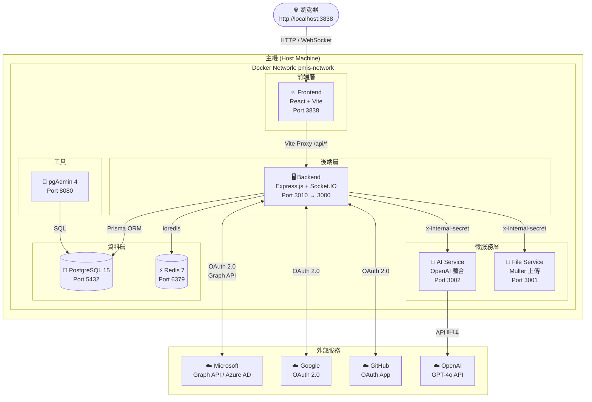
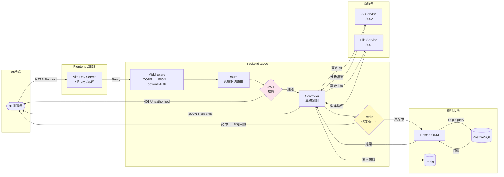
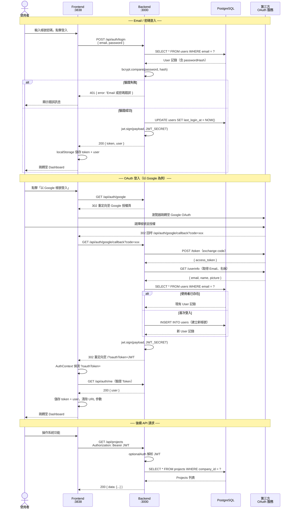
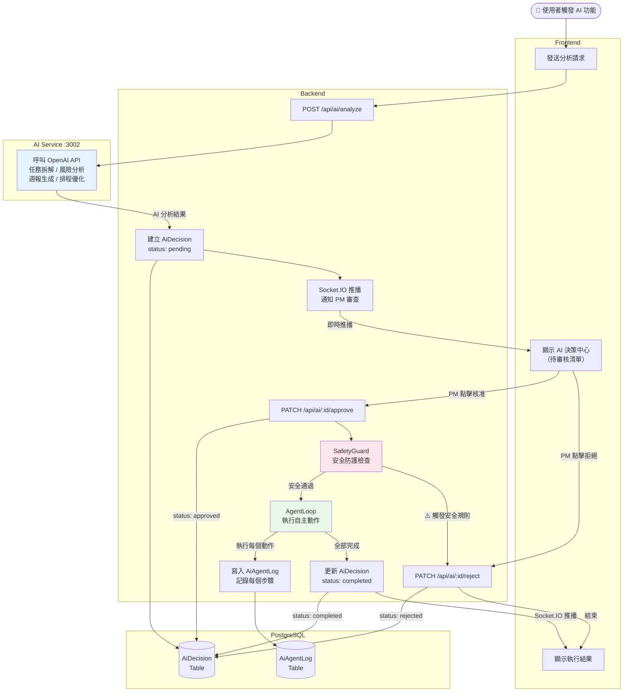
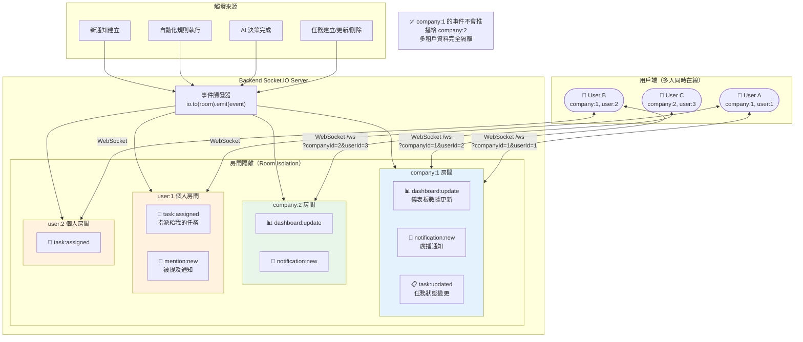

# xCloudPMIS

> 企業級專案管理資訊系統（Project Management Information System）
> 多租戶架構 · AI 決策輔助 · 即時協作 · OAuth 2.0 整合

---

## 目錄

- [系統概述](#系統概述)
- [技術棧](#技術棧)
- [系統架構圖](#系統架構圖)
  - [整體服務架構](#整體服務架構)
  - [資料庫 ER 圖](#資料庫-er-圖)
  - [API 請求資料流程](#api-請求資料流程)
  - [身份認證流程](#身份認證流程)
  - [AI 決策流程](#ai-決策流程-human-in-the-loop)
  - [即時推播架構](#即時推播架構)
- [服務清單](#服務清單)
- [快速啟動](#快速啟動)
- [環境變數](#環境變數)
- [API 端點](#api-端點)
- [資料庫結構](#資料庫結構)
- [OAuth 整合設定](#oauth-整合設定)
- [AI 服務](#ai-服務)
- [部署指南](#部署指南)
- [開發說明](#開發說明)

---

## 系統概述

xCloudPMIS 是一套為企業內部設計的全端專案管理平台，核心功能涵蓋：

| 功能模組 | 說明 |
|----------|------|
| **專案與任務管理** | 多層任務樹、看板、甘特圖、里程碑追蹤 |
| **工時記錄** | 計時器、工時統計、工作負載分析 |
| **AI 決策輔助** | 任務拆解、風險分析、週報生成、排程優化 |
| **自動化規則引擎** | 觸發條件 + 動作組合，自動更新狀態與通知 |
| **即時推播** | Socket.IO 公司/個人房間，儀表板與通知零延遲更新 |
| **OAuth 2.0 登入** | Microsoft Azure AD / Google / GitHub 三方認證 |
| **多租戶隔離** | 公司（Company）級資料隔離，支援多組織共用同一實例 |
| **報表與儀表板** | 專案健康度、資源負載、工時報表匯出 |

---

## 技術棧

### 前端

| 項目 | 技術 | 版本 |
|------|------|------|
| 框架 | React | 18.2.0 |
| 建置工具 | Vite | 5.0.8 |
| 拖拽排序 | @dnd-kit/core + @dnd-kit/sortable | 6.3.1 |
| 圖表 | Recharts | 2.15.4 |
| 樣式 | 純 CSS（CSS Variables 設計令牌，支援深色模式） | — |

### 後端

| 項目 | 技術 | 版本 |
|------|------|------|
| 框架 | Express.js | 4.18.2 |
| ORM | Prisma | 5.8.1 |
| 即時通訊 | Socket.IO | 4.8.3 |
| 認證 | JWT (jsonwebtoken) + bcryptjs | — |
| OAuth | @azure/msal-node（Microsoft） | 3.8.10 |
| 快取 | Redis (redis) | 4.6.13 |
| 檔案上傳 | Multer | 1.4.5 |

### 資料層

| 項目 | 技術 | 版本 |
|------|------|------|
| 資料庫 | PostgreSQL | 15 |
| 快取 / Session | Redis | 7 |
| DB 管理工具 | pgAdmin | 4 |

### AI 整合

| 項目 | 說明 |
|------|------|
| 主要 API | OpenAI GPT-4o（複雜推理）/ GPT-4o-mini（快速任務） |
| 企業私有部署 | Azure OpenAI（自訂 baseURL） |
| 本機開發 | Ollama 開源模型（可替換） |
| 管理方式 | DB 動態配置（AiModelConfig），優先順序：DB → ENV → 預設值 |

### 基礎設施

| 項目 | 技術 |
|------|------|
| 容器化 | Docker + Docker Compose |
| 雲端部署 | Azure Container Apps + Azure Database for PostgreSQL + Azure Cache for Redis |
| 地端部署 | Docker Compose + Nginx 反向代理 |
| CI/CD | GitHub Actions（Azure ACR 自動推送） |

---

## 系統架構圖

### 整體服務架構



---

### 資料庫 ER 圖

> 核心業務模型關聯（共 33 個 Prisma 模型，以下展示主要關係）

```mermaid
erDiagram
    Company {
        int     id          PK
        string  name
        string  slug
        string  logo_url
        bool    is_active
    }

    User {
        int     id          PK
        int     company_id  FK
        string  name
        string  email       UK
        string  password_hash
        enum    role
        string  department
        string  job_title
        bool    is_active
        datetime last_login_at
    }

    OAuthToken {
        int     id          PK
        int     user_id     FK  UK
        string  provider
        text    access_token
        text    refresh_token
        datetime expires_at
        string  microsoft_user_id
    }

    Project {
        int     id          PK
        int     company_id  FK
        int     owner_id    FK
        int     workspace_id FK
        string  name
        enum    status
        date    start_date
        date    end_date
        decimal budget
    }

    Task {
        int     id          PK
        int     project_id  FK
        int     assignee_id FK
        int     parent_task_id FK
        string  title
        enum    status
        enum    priority
        float   estimated_hours
        float   actual_hours
        int     progress_percent
        date    due_date
    }

    Milestone {
        int     id          PK
        int     project_id  FK
        string  name
        date    due_date
        bool    is_achieved
    }

    TimeEntry {
        int     id          PK
        int     task_id     FK
        int     user_id     FK
        datetime started_at
        datetime ended_at
        int     duration_minutes
        text    description
    }

    Attachment {
        int     id          PK
        int     task_id     FK
        int     uploaded_by FK
        string  original_name
        string  stored_name
        string  mime_type
        int     file_size_bytes
    }

    Comment {
        int     id          PK
        int     task_id     FK
        int     user_id     FK
        int     parent_id   FK
        text    content
        json    mentions
    }

    ChecklistItem {
        int     id          PK
        int     task_id     FK
        string  title
        bool    is_done
        int     position
    }

    TaskDependency {
        int     id              PK
        int     task_id         FK
        int     depends_on_id   FK
        enum    dependency_type
    }

    Workspace {
        int     id          PK
        int     company_id  FK
        string  name
        enum    visibility
    }

    Team {
        int     id          PK
        int     workspace_id FK
        string  name
        string  color
    }

    TeamMember {
        int     id          PK
        int     team_id     FK
        int     user_id     FK
        enum    role
    }

    AutomationRule {
        int     id              PK
        int     company_id      FK
        string  name
        string  trigger_type
        json    conditions
        json    actions
        bool    is_active
    }

    AutomationRuleRun {
        int     id          PK
        int     rule_id     FK
        enum    status
        json    context
        datetime triggered_at
    }

    AiDecision {
        int     id          PK
        int     company_id  FK
        int     project_id  FK
        string  decision_type
        json    context
        json    result
        enum    status
    }

    Notification {
        int     id          PK
        int     user_id     FK
        string  type
        string  title
        text    body
        bool    is_read
    }

    Company         ||--o{ User            : "擁有"
    Company         ||--o{ Project         : "擁有"
    Company         ||--o{ Workspace       : "擁有"
    Company         ||--o{ AutomationRule  : "設定"
    Company         ||--o{ AiDecision      : "發起"
    User            ||--o| OAuthToken      : "連結"
    User            ||--o{ TimeEntry       : "記錄"
    User            ||--o{ Notification    : "接收"
    User            ||--o{ Comment         : "撰寫"
    User            ||--o{ TeamMember      : "加入"
    Project         ||--o{ Task            : "包含"
    Project         ||--o{ Milestone       : "設定"
    Task            ||--o{ Task            : "子任務"
    Task            ||--o{ TimeEntry       : "記錄工時"
    Task            ||--o{ Attachment      : "附件"
    Task            ||--o{ Comment         : "評論"
    Task            ||--o{ ChecklistItem   : "待辦清單"
    Task            ||--o{ TaskDependency  : "依賴"
    Workspace       ||--o{ Team            : "包含"
    Team            ||--o{ TeamMember      : "成員"
    AutomationRule  ||--o{ AutomationRuleRun : "執行記錄"
```

---

### API 請求資料流程



---

### 身份認證流程



---

### AI 決策流程（Human-in-the-Loop）



---

### 即時推播架構



---

## 服務清單

| 服務名稱 | 容器名稱 | 對外埠 | 說明 |
|----------|----------|--------|------|
| Frontend | pmis-frontend | 3838 | React + Vite 開發伺服器 |
| Backend | pmis-backend | 3010 | Express.js API + Socket.IO |
| AI Service | pmis-ai-service | 3002 | OpenAI 任務分析微服務 |
| File Service | pmis-file-service | 3001 | 檔案上傳下載微服務 |
| PostgreSQL | pmis-postgres | 5432 | 主資料庫 |
| Redis | pmis-redis | 6379 | 快取 + Session |
| pgAdmin | pmis-pgadmin | 8080 | 資料庫管理介面 |

---

## 快速啟動

### 前置需求

- Docker Desktop（>= 4.0）
- Docker Compose（>= 2.0）

### 步驟

```bash
# 1. 複製環境變數設定
cp .env.example .env

# 2. 編輯必要的設定值（建議至少修改 JWT_SECRET）
nano .env

# 3. 啟動所有服務
docker compose up -d

# 4. 等待約 30–60 秒後開啟系統
open http://localhost:3838
```

### 預設帳號（seed 資料）

| Email | 密碼 | 角色 |
|-------|------|------|
| admin@xcloud.com | admin123 | 管理員 |
| pm@xcloud.com | admin123 | 專案經理 |
| dev@xcloud.com | admin123 | 成員 |

> ⚠️ 正式環境部署前請務必變更預設密碼。

### 常用指令

```bash
# 查看後端日誌
docker logs -f pmis-backend

# 重置資料庫（含重跑 seed）
docker exec pmis-backend npx prisma migrate reset --force

# 進入 backend 容器
docker exec -it pmis-backend sh
```

---

## 環境變數

完整說明請參閱 `.env.example`。

### 基礎設定（必填）

```env
POSTGRES_DB=pmis_db
POSTGRES_USER=pmis_user
POSTGRES_PASSWORD=your-strong-password
REDIS_PASSWORD=your-redis-password

# 產生方式：node -e "console.log(require('crypto').randomBytes(64).toString('hex'))"
JWT_SECRET=your-super-secret-jwt-key

FRONTEND_URL=http://localhost:3838
OAUTH_CALLBACK_BASE=http://localhost:3838
```

### AI 服務（選填）

```env
OPENAI_API_KEY=sk-your-openai-api-key
AI_LANGUAGE=zh-TW
AI_MAX_TOKENS=2000
```

### OAuth 登入（選填）

```env
MICROSOFT_CLIENT_ID=xxxxxxxx-xxxx-xxxx-xxxx-xxxxxxxxxxxx
MICROSOFT_CLIENT_SECRET=your-secret
MICROSOFT_TENANT_ID=common

GOOGLE_CLIENT_ID=xxx.apps.googleusercontent.com
GOOGLE_CLIENT_SECRET=GOCSPX-xxx

GITHUB_CLIENT_ID=Iv1.xxx
GITHUB_CLIENT_SECRET=your-secret
```

---

## API 端點

### 認證

| 方法 | 端點 | 說明 |
|------|------|------|
| POST | `/api/auth/login` | Email / 密碼登入，回傳 JWT |
| GET | `/api/auth/me` | 驗證 Token，回傳當前使用者 |
| POST | `/api/auth/logout` | 登出（前端清除 Token） |
| GET | `/api/auth/microsoft` | 啟動 Microsoft OAuth |
| GET | `/api/auth/microsoft/callback` | Microsoft OAuth 回呼 |
| GET | `/api/auth/google` | 啟動 Google OAuth |
| GET | `/api/auth/google/callback` | Google OAuth 回呼 |
| GET | `/api/auth/github` | 啟動 GitHub OAuth |
| GET | `/api/auth/github/callback` | GitHub OAuth 回呼 |

### 核心業務

| 方法 | 端點 | 說明 |
|------|------|------|
| GET | `/api/dashboard/summary` | 儀表板摘要（KPI、健康度、負載、洞察） |
| GET / POST | `/api/projects` | 專案列表 / 建立專案 |
| GET / PATCH / DELETE | `/api/projects/:id` | 專案詳情 / 更新 / 刪除 |
| GET / POST | `/api/tasks` | 任務列表 / 建立任務 |
| GET / PATCH / DELETE | `/api/tasks/:id` | 任務詳情 / 更新 / 刪除 |
| GET | `/api/my-tasks` | 我的任務（當前登入者） |
| GET | `/api/gantt` | 甘特圖資料 |
| GET / POST | `/api/time-tracking` | 工時記錄列表 / 建立 |
| POST | `/api/time-tracking/start` | 開始計時 |
| GET | `/api/team` | 團隊成員列表 |
| GET | `/api/users` | 公司用戶列表（指派選單用） |

### 進階功能

| 方法 | 端點 | 說明 |
|------|------|------|
| GET | `/api/reports/projects` | 專案報表 |
| GET | `/api/reports/timelog` | 工時報表 |
| GET | `/api/notifications` | 通知列表 |
| GET | `/api/notifications/unread-count` | 未讀通知數量 |
| PATCH | `/api/notifications/:id/read` | 標記已讀 |
| PATCH | `/api/notifications/read-all` | 全部標記已讀 |
| GET / POST / PATCH / DELETE | `/api/rules` | 自動化規則 CRUD |
| GET / PATCH | `/api/ai` | AI 決策中心（審查 / 核准 / 拒絕） |
| GET | `/api/settings/company` | 公司設定 |
| GET / PATCH | `/api/settings/profile` | 個人設定 |
| GET | `/api/health` | 外部服務連線狀態 |

### AI 微服務（內部，需 `x-internal-secret` 標頭）

| 方法 | 端點 | 說明 |
|------|------|------|
| POST | `/breakdown` | 任務拆解 → 子任務清單 |
| POST | `/risk` | 風險分析 → 評分 0–100 + 建議 |
| POST | `/weekly-report` | 週報生成 → Markdown 報告 |
| POST | `/schedule` | 排程優化 → 關鍵路徑建議 |
| POST | `/health-score` | 專案健康評分（純計算） |

### 檔案服務（內部，需 `x-internal-secret` 標頭）

| 方法 | 端點 | 說明 |
|------|------|------|
| POST | `/upload` | 上傳檔案（multipart/form-data，field: `files`） |
| GET | `/download/:storedName` | 串流下載 |
| DELETE | `/:storedName` | 刪除檔案 |

---

## 資料庫結構

Prisma Schema 共定義 **33 個模型**，分為以下群組：

### 核心模型

```
Company
  └── User (companyId)
       └── OAuthToken       ← Microsoft 365 委派 Token
  └── Project (companyId)
       └── Task (projectId)
            ├── TaskDependency  ← 任務依賴（finish_to_start 等）
            ├── ChecklistItem   ← 待辦清單項目
            ├── TimeEntry       ← 工時記錄
            ├── Attachment      ← 附件
            └── Comment         ← 評論（支援巢狀回覆）
  └── Workspace
       └── Team
            └── TeamMember
```

### 自動化與 AI 模型

```
AutomationRule
  ├── trigger_type (task.created / task.updated / date.reached / ...)
  ├── conditions   (JSON 條件運算式)
  ├── actions      (JSON 動作列表)
  └── AutomationRuleRun  ← 執行記錄

AiDecision
  ├── status  (pending → approved/rejected → executing → completed)
  ├── context (JSON AI 分析輸入)
  ├── result  (JSON AI 建議輸出)
  └── AiAgentLog  ← 代理執行步驟日誌

AiModelConfig  ← 公司級 AI 模型設定（model, baseUrl, temperature）
```

### 重要枚舉

| Enum | 值 |
|------|----|
| `Role` | `admin` / `pm` / `member` |
| `TaskStatus` | `todo` / `in_progress` / `review` / `done` / `cancelled` |
| `TaskPriority` | `urgent` / `high` / `medium` / `low` |
| `ProjectStatus` | `planning` / `active` / `on_hold` / `completed` / `cancelled` |
| `DependencyType` | `finish_to_start` / `start_to_start` / `finish_to_finish` |

---

## OAuth 整合設定

### Microsoft Azure AD（Entra ID）

1. 前往 [portal.azure.com](https://portal.azure.com) → 應用程式註冊 → 新增
2. **支援的帳戶類型**：「任何組織目錄中的帳戶」（多租戶）
3. **重新導向 URI**：`http://localhost:3838/api/auth/microsoft/callback`
4. 建立用戶端密碼：憑證和祕密 → 新增用戶端密碼
5. API 權限：`openid`、`profile`、`email`、`User.Read`
6. 將 **應用程式識別碼**、**密碼值**、**租用戶識別碼** 填入 `.env`

### Google OAuth 2.0

1. 前往 [console.cloud.google.com](https://console.cloud.google.com) → API 和服務 → 憑證
2. 建立 OAuth 2.0 用戶端 ID（類型：網頁應用程式）
3. **重新導向 URI**：`http://localhost:3838/api/auth/google/callback`
4. 將 **用戶端 ID** 和 **用戶端密碼** 填入 `.env`

### GitHub OAuth App

1. 前往 [github.com/settings/developers](https://github.com/settings/developers) → New OAuth App
2. **Homepage URL**：`http://localhost:3838`
3. **Callback URL**：`http://localhost:3838/api/auth/github/callback`
4. 將 **Client ID** 和 **Client Secret** 填入 `.env`

> **說明**：OAuth 憑證未設定時，對應登入按鈕點擊後會重定向回登入頁並顯示友善錯誤提示，系統其他功能不受影響。

---

## AI 服務

AI Service 作為獨立微服務運行（Port 3002），避免長時間 AI 請求（5–30 秒）阻塞主 Backend event loop。

### 模型配置優先順序

```
1. DB（AiModelConfig — 可由管理員透過 UI 動態修改，快取 30 秒）
2. 環境變數（OPENAI_API_KEY）
3. 預設值（gpt-4o-mini）
```

### 支援的 AI 任務

| 任務 | 輸入 | 輸出 |
|------|------|------|
| 任務拆解 | 專案目標、團隊規模、技術棧、工期 | 子任務清單、總估時 |
| 風險分析 | 專案資料（任務、里程碑、團隊） | 風險評分 (0–100)、風險因子、改善建議 |
| 週報生成 | 本週完成 / 進行中 / 阻塞任務 | 主旨行、Markdown 報告、純文字版本 |
| 排程優化 | 任務清單、截止日期、團隊 | 關鍵路徑、工作負載重新分配建議 |

---

## 部署指南

### 地端（On-Premises）

```bash
# 自動化安裝腳本（支援 Ubuntu / Debian / RHEL）
sudo bash deploy/onprem/setup.sh

# 或手動：
cp .env.production.example .env.production
docker compose -f docker-compose.prod.yml up -d
```

### Azure Container Apps

```bash
# 1. 建立 Azure 資源
export RESOURCE_GROUP=pmis-rg
export LOCATION=eastasia
bash deploy/azure/azure-setup.sh

# 2. 建置並推送映像
bash deploy/azure/acr-build-push.sh

# CI/CD 由 .github/workflows/deploy-azure.yml 自動執行
git push origin main
```

### 備份（地端）

```bash
# 手動執行 PostgreSQL + Volume 備份
bash deploy/onprem/backup.sh

# 建議 cron（每日凌晨 2:00）
0 2 * * * /opt/pmis/deploy/onprem/backup.sh
```

---

## 開發說明

### 目錄結構

```
runtime/
├── backend/
│   ├── prisma/
│   │   ├── schema.prisma              # DB Schema（33 個模型）
│   │   └── seed.js                    # 測試資料
│   └── src/
│       ├── index.js                   # 入口（路由掛載、Socket.IO）
│       ├── middleware/
│       │   ├── requireAuth.js         # 強制 JWT 驗證
│       │   ├── optionalAuth.js        # 嘗試 JWT 驗證（不強制）
│       │   └── oauthAuth.js           # OAuth 委派授權檢查
│       ├── routes/
│       │   ├── auth/
│       │   │   ├── login.js           # Email 登入、/me、/logout
│       │   │   ├── oauthHelper.js     # OAuth 共用工具（find/create user、JWT）
│       │   │   ├── microsoftOAuth.js  # Microsoft OAuth 登入流程
│       │   │   ├── google.js          # Google OAuth 登入流程
│       │   │   ├── github.js          # GitHub OAuth 登入流程
│       │   │   └── microsoft.js       # Microsoft 365 委派設定
│       │   └── [其他路由模組…]
│       └── services/
│           ├── cache.js               # Redis 操作封裝
│           ├── notificationCenter.js  # 通知廣播
│           ├── automationRuleService.js
│           ├── emailService.js        # Microsoft Graph 郵件
│           └── autonomous-agent/
│               ├── core/agentLoop.js  # AI 決策執行循環
│               └── decisionEngine/safetyGuard.js
│
├── frontend/
│   └── src/
│       ├── App.jsx                    # 根元件（ErrorBoundary、AuthGuard）
│       ├── system-theme.css           # CSS 設計令牌（--xc-* 變數）
│       ├── context/
│       │   ├── AuthContext.jsx        # 認證狀態（JWT + OAuth callback）
│       │   └── ThemeContext.jsx       # 深色 / 淺色主題
│       └── components/               # 22 個頁面元件
│
├── ai-service/server.js               # OpenAI 分析 API（5 個端點）
├── file-service/server.js             # 檔案上傳 / 下載 API（3 個端點）
├── docker-compose.yml                 # 開發環境（7 個服務）
├── docker-compose.prod.yml            # 生產環境
└── .env.example                       # 環境變數範本（含 OAuth 說明）
```

### Prisma 常用指令

```bash
docker exec -it pmis-backend sh

npx prisma migrate dev --name your-migration-name  # 開發
npx prisma migrate deploy                           # 生產
npx prisma studio                                   # 視覺化瀏覽器
```

### 前端獨立開發（容器外）

```bash
cd frontend
npm install
VITE_PROXY_TARGET=http://localhost:3010 npm run dev
```

---

## 關鍵設計決策

| 決策 | 原因 |
|------|------|
| **AI / File 微服務分離** | 防止 5–30 秒的 AI 推理或大檔案 I/O 阻塞主 Express event loop |
| **Human-in-the-Loop AI** | AI 建議須經 PM 核准才執行，避免自動化誤操作造成資料異動 |
| **Socket.IO 房間隔離** | 公司 / 個人雙層房間，實現多租戶即時推播隔離 |
| **OAuth callback 透過 Vite Proxy** | 開發時保持單一 origin（localhost:3838），OAuth Redirect URI 設定更簡潔 |
| **Prisma ORM + Migrate** | 型態安全 + 版本控制 DB Schema，避免手動 SQL 維護問題 |
| **CSS Variables 設計令牌** | 一套 `--xc-*` 變數同時支援深色 / 淺色主題，不依賴外部 CSS 框架 |
| **Redis AOF 持久化** | 確保 Redis 重啟後快取資料不遺失，適合存 Session 和即時資料 |
| **內部微服務認證** | `x-internal-secret` 標頭隔離外部呼叫，AI / File 服務不對外暴露 |
| **`companyId` 多租戶過濾** | 所有業務查詢帶 `WHERE company_id = ?`，資料強制隔離 |

---

## 授權

Copyright © 2026 xCloud 科技．All rights reserved.
