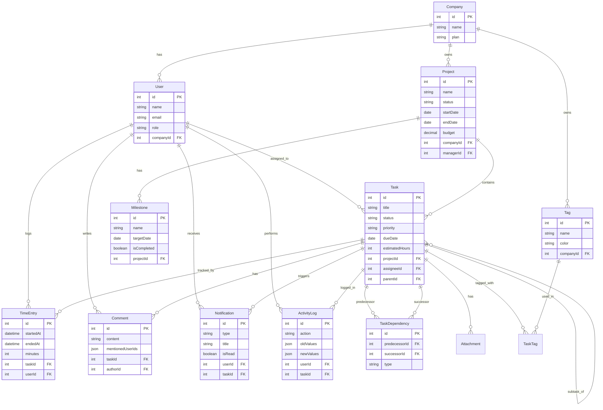

# xCloudPMIS — 企業級專案管理系統

> 類 Asana 的雲端專案管理平台，採用 Docker 全容器化架構，適合中小型團隊使用。

[](https://nodejs.org)
[](https://react.dev)
[](https://www.postgresql.org)
[](https://redis.io)
[](https://www.docker.com)

---

## 目錄

- [系統介紹](#系統介紹)
- [系統架構圖](#系統架構圖)
- [資料庫 ER 圖](#資料庫-er-圖)
- [技術堆疊](#技術堆疊)
- [快速啟動](#快速啟動)
- [服務清單](#服務清單)
- [API 文件](#api-文件)
- [專案結構](#專案結構)
- [開發進度](#開發進度)

---

## 系統介紹

xCloudPMIS 是一套企業級專案管理資訊系統（Project Management Information System），核心功能包含：

| 功能模組 | 說明 |
|---------|------|
| **專案管理** | 建立、追蹤、管理多個工程專案 |
| **任務排程** | 任務指派、截止日期、優先順序管理 |
| **任務相依** | 設定任務前置條件（Finish-to-Start） |
| **里程碑** | 重要節點追蹤與達成率計算 |
| **時間記錄** | 即時計時器 + 手動時間登錄 |
| **標籤系統** | 自訂標籤分類任務 |
| **評論協作** | 任務討論、@mention 通知 |
| **健康儀表板** | 紅黃綠燈號即時監控所有專案狀態 |
| **人力熱力圖** | 未來 14 天工作量視覺化 |
| **可行動洞察** | 自動標出高風險項目的建議卡 |

---

## 系統架構圖

```
┌─────────────────────────────────────────────────────────────────────┐
│                        使用者瀏覽器                                  │
└───────────────────────────┬─────────────────────────────────────────┘
                            │ HTTP
                            ▼
┌─────────────────────────────────────────────────────────────────────┐
│                    Docker Network: pmis-network                      │
│                                                                     │
│   ┌──────────────────┐           ┌──────────────────┐              │
│   │  前端 (React)     │  API Call │  後端 (Express)  │              │
│   │  port 3001       │ ────────► │  port 3010→3000  │              │
│   │                  │           │                  │              │
│   │  • Dashboard     │           │  • RESTful API   │              │
│   │  • 摘要卡片      │           │  • Prisma ORM    │              │
│   │  • 健康圓餅圖    │           │  • 業務邏輯      │              │
│   │  • 人力熱力圖    │           │                  │              │
│   │  • 可行動洞察    │           └────────┬─────────┘              │
│   └──────────────────┘                    │                        │
│                                           ├──────────────────┐     │
│                                           │                  │     │
│                                           ▼                  ▼     │
│                              ┌────────────────┐  ┌─────────────┐  │
│                              │  PostgreSQL 15  │  │   Redis 7   │  │
│                              │  port 5432      │  │  port 6379  │  │
│                              │                 │  │             │  │
│                              │  • 13 張資料表  │  │  • API 快取 │  │
│                              │  • 6 個 VIEW    │  │  • 60s TTL  │  │
│                              │  • 複雜聚合查詢 │  │             │  │
│                              └────────────────┘  └─────────────┘  │
│                                                                     │
│   ┌──────────────────┐                                             │
│   │  pgAdmin 4        │  (資料庫管理介面)                           │
│   │  port 8080        │                                             │
│   └──────────────────┘                                             │
└─────────────────────────────────────────────────────────────────────┘
```

### 請求流程

```
瀏覽器 → React (3001) → Express API (3010) → Redis 快取檢查
                                                    │
                                          ┌─────────┴──────────┐
                                     快取命中              快取未命中
                                          │                    │
                                     直接回傳            PostgreSQL 查詢
                                                              │
                                                        寫入 Redis 快取
                                                              │
                                                          回傳資料
```

---

## 資料庫 ER 圖



---

## 技術堆疊

| 層級 | 技術 | 版本 | 說明 |
|------|------|------|------|
| **前端** | React | 18 | UI 元件框架 |
| | Vite | 5 | 開發伺服器 & 打包工具 |
| | Recharts | 2 | 圖表視覺化（PieChart、ResponsiveContainer） |
| **後端** | Node.js | 20 | 執行環境 |
| | Express | 4 | HTTP 框架 |
| | Prisma | 5 | ORM（含 `$queryRaw` 複雜查詢） |
| **資料庫** | PostgreSQL | 15 | 主要資料庫，含 6 個儀表板 VIEW |
| | Redis | 7 | API 快取層（AOF 持久化） |
| **管理工具** | pgAdmin | 4 | 資料庫視覺化管理介面 |
| **基礎設施** | Docker | - | 容器化所有服務 |
| | Docker Compose | - | 多服務編排 |

---

## 快速啟動

### 前置需求

- [Docker Desktop](https://www.docker.com/products/docker-desktop/) 已安裝並啟動
- Git

### 步驟

```bash
# 1. Clone 專案
git clone https://github.com/guessleej/xCloudPMIS.git
cd xCloudPMIS

# 2. 切換到開發分支
git checkout feat/phase1-4

# 3. 啟動所有服務（首次需要建置映像，約 2-3 分鐘）
docker compose up -d

# 4. 等待服務健康（查看狀態）
docker compose ps

# 5. 初始化資料庫 schema
docker exec pmis-backend npx prisma db push

# 6. 套用儀表板 SQL Views
docker exec -i pmis-postgres psql -U pmis_user -d pmis_db < database/dashboard_views.sql

# 7. 填入範例資料
docker exec pmis-backend node prisma/seed.js

# 8. 開啟瀏覽器
open http://localhost:3001
```

### 停止服務

```bash
docker compose down          # 停止（保留資料）
docker compose down -v       # 停止並刪除所有資料（重設）
```

---

## 服務清單

| 服務 | 位址 | 帳號 | 密碼 |
|------|------|------|------|
| **前端 Dashboard** | http://localhost:3001 | — | — |
| **後端 API** | http://localhost:3010 | — | — |
| **pgAdmin 管理介面** | http://localhost:8080 | admin@pmis.com | admin123 |
| **PostgreSQL** | localhost:5432 | pmis_user | pmis_password |
| **Redis** | localhost:6379 | — | redis123 |

---

## API 文件

### 健康檢查

```
GET  /health          → 服務存活檢查
GET  /api/status      → 所有服務連線狀態（DB、Redis）
```

### 儀表板 API

| 方法 | 路徑 | 說明 |
|------|------|------|
| `GET` | `/api/dashboard/executive-summary` | 全公司執行摘要（紅黃綠燈數量、完成率） |
| `GET` | `/api/dashboard/projects-health` | 各專案健康狀態列表 |
| `GET` | `/api/dashboard/workload` | 未來 14 天人力負載熱力圖資料 |
| `GET` | `/api/dashboard/actionable-insights` | 本週優先行動建議 |

### 專案 API

| 方法 | 路徑 | 說明 |
|------|------|------|
| `GET` | `/api/projects` | 取得所有專案（含 Redis 快取） |
| `POST` | `/api/projects` | 建立新專案 |

### 統一回應格式

```json
{
  "success": true,
  "data": { "..." : "..." },
  "meta": { "total": 10 },
  "timestamp": "2026-03-08T00:00:00.000Z"
}
```

---

## 專案結構

```
xCloudPMIS/
├── docker-compose.yml              # 服務編排設定
│
├── backend/                        # Node.js Express 後端
│   ├── Dockerfile
│   ├── package.json
│   ├── prisma/
│   │   ├── schema.prisma           # 資料庫 Schema（13 張表）
│   │   └── seed.js                 # 範例資料
│   └── src/
│       ├── index.js                # 主程式入口
│       └── routes/
│           └── dashboard.js        # 儀表板 API（4 個端點）
│
├── frontend/                       # React + Vite 前端
│   ├── Dockerfile
│   ├── package.json
│   └── src/
│       ├── App.jsx
│       └── components/
│           └── dashboard/
│               ├── Dashboard.jsx           # 主儀表板佈局
│               ├── useDashboard.js         # 資料 Hook
│               ├── SummaryCards.jsx        # 摘要統計卡片
│               ├── HealthPieChart.jsx      # 健康狀態圓餅圖
│               ├── WorkloadHeatmap.jsx     # 人力負載熱力圖
│               ├── ProjectHealthList.jsx   # 專案健康列表
│               └── ActionableInsights.jsx  # 可行動洞察卡片
│
└── database/
    ├── init/                       # Docker 初始化 SQL
    ├── dashboard_views.sql         # 6 個儀表板 PostgreSQL VIEW
    ├── schema_reference.sql        # Phase 1-2 Schema 參考
    └── phase3_reference.sql        # Phase 3 進階 Schema 參考
```

---

## 開發進度

### ✅ Phase 1 — 基礎架構
- Docker Compose 五服務環境（PostgreSQL、pgAdmin、Redis、Express、React）
- Prisma ORM 初始 Schema（Company、User、Project、Task）

### ✅ Phase 2 — 核心 CRUD
- 專案與任務的 RESTful API
- Redis 快取層（60 秒 TTL）
- 前端列表與表單元件

### ✅ Phase 3 — 進階功能
- 8 張新資料表（Milestone、TimeEntry、Attachment、Comment、Tag、TaskDependency、Notification、ActivityLog）
- 任務相依性（9 個相依關係，含線性鏈 & 菱形結構）
- 時間記錄（含即時計時器，Partial Unique Index 防止重複計時）
- @mention 通知系統（JSONB 欄位儲存）

### ✅ Phase 4 — 執行儀表板
- 6 個 PostgreSQL VIEWs（紅黃綠健康燈號，含截止日期、預算超支、逾期率三重判斷）
- 4 個 Dashboard API 端點（`$queryRaw` 複雜聚合查詢）
- React 儀表板：摘要卡片、健康圓餅圖（Recharts）、14 天人力熱力圖、可行動洞察

### 🚧 Phase 5 — 部署上線（計畫中）
- 雲端部署（DigitalOcean / AWS Lightsail）
- Nginx 反向代理 + Let's Encrypt SSL
- 監控告警 + 自動備份
- CI/CD 流程（GitHub Actions）
- 使用者認證（JWT）

---

## 授權

MIT License
